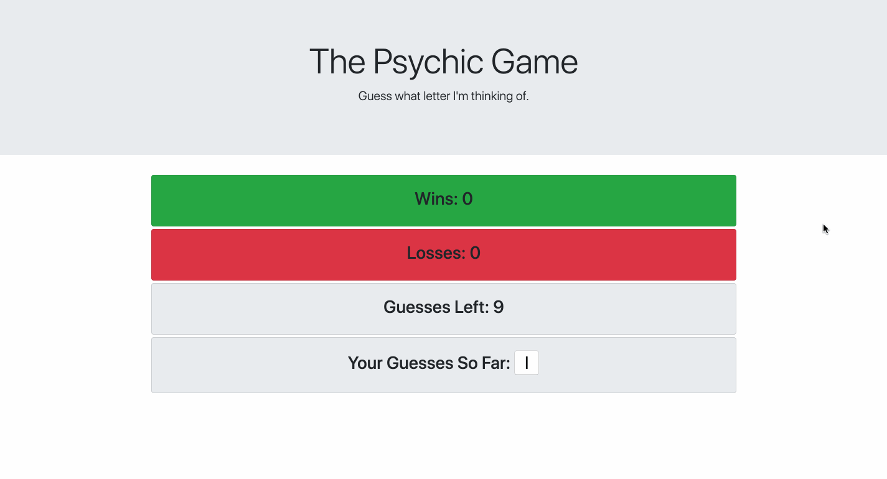
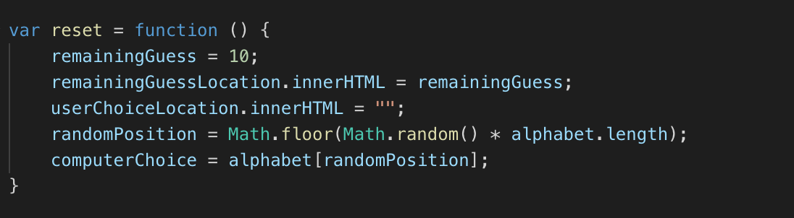
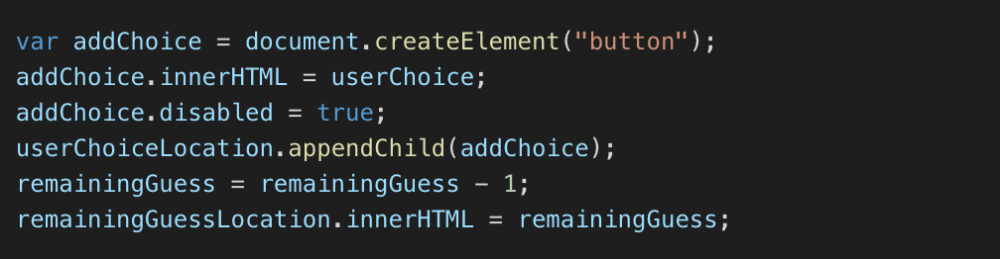

# Psychic-Game

[Link to deployed site](https://leticiaroncero.github.io/Psychic-Game/)

## Description
In this guessing game, the computer randomly picks a letter, and the user has to guess which letter the computer chose by pressing a letter key on the keyboard. The user gets 10 guesses per round. The goal of this project was to use JavaScript code to create dynamic HTML content.

## Technologies used
- JavaScript
- HTML5
- CSS
- Bootstrap

## GIF Walkthrough

## Essential Code

Function to reset guesses left back to 10, clean existing guesses, and get the computer to pick a new letter after winning or losing:

Code to update the content of the page with the letter the user inputs, and update the remaining guesses:

